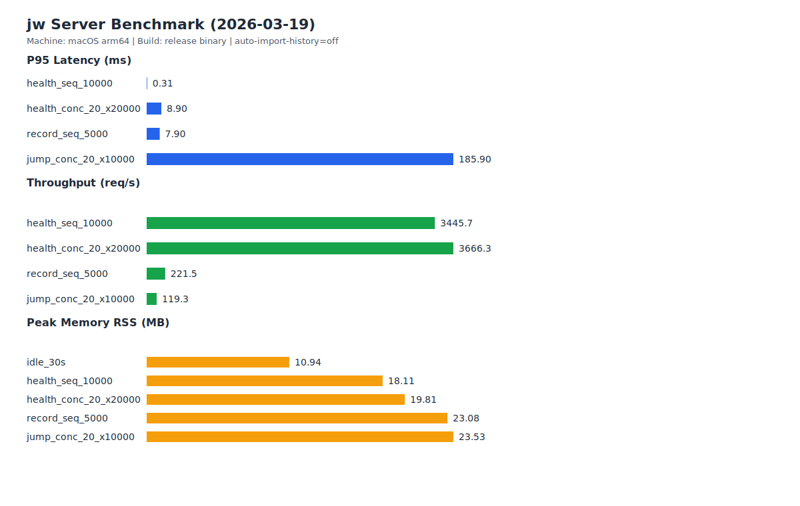

# jw

终端网页快速跳转工具（zoxide-like for web）。

你可以把常用网页记到本地，然后直接用关键词跳转。

## 30 秒上手
```bash
jw tutorial
jw add https://github.com GitHub
jw github
jw list
```

## 产品介绍与命令入口
- `jw about`：产品介绍与 30 秒上手路径（短平快）。
- `jw help`：完整命令入口与语义说明（权威速查）。
- `jw tutorial`：可执行教程，按步骤跑完整流程。

## 命令速查（精简）
- `jw server [addr]`：前台启动本地记录服务（自动选择空闲端口），提供 `/health`、`/record`、`/jump` 接口。
- `jw server start [addr]` / `jw server stop` / `jw server status`：后台启动、停止、查看服务状态。
- `jw config`：查看本地配置。
- `jw config auto-import-history on|off`：开启/关闭自动导入 Chrome 浏览器记录（服务启动后定时导入）。
- `jw add <url> [title]`：向本地库写入或更新网址记录。
- `jw query <keyword>`：查看关键词候选与分数。
- `jw jump <keyword>` / `jw <keyword>`：打开最佳匹配网页，并更新命中计数。
- `jw list` / `jw rm <url|title>`：查看和清理本地记录。
- 需要完整说明时，请运行 `jw help`。

## 本地记录服务
前台启动：
```bash
jw server
```

后台启动（推荐）：
```bash
jw server start
jw server status
```

停止后台服务：
```bash
jw server stop
```

开启自动导入浏览器记录：
```bash
jw config auto-import-history on
```

接口：
- `GET /health`
- `POST /record`
- `GET /jump?q=<keyword>`

## 是否需要后台服务？
- 不需要后台也能用：`jw add/query/jump/list/rm` 全部可直接运行。
- 建议开后台的场景：
  - 你要让浏览器插件或脚本通过 HTTP 调 `jw`（`/record`、`/jump`）。
  - 你要开启“自动导入浏览器记录”（需要常驻进程定时执行）。
- 常用命令：
  - `jw server start`：后台启动
  - `jw server status`：查看状态
  - `jw server stop`：停止后台

## 后台开销（实测数据）
测试时间：`2026-03-19`  
测试环境：`macOS arm64`、`go build` 产物、`auto-import-history=off`

核心结论（这台机器实测）：
- 空闲 30s：`avg_cpu=0.02%`，`peak_rss=10.94MB`
- 轻量接口（`/health`）高频调用：吞吐可到 `3.4k-3.6k req/s`
- 写入型接口（`/record`、`/jump`）会明显吃 CPU（涉及本地存储写入与排序）
- 即便在高压场景，常驻内存峰值约 `23.53MB`

### 批量图（实测）


### 数据表（实测）
| Scenario | Requests | Concurrency | Throughput (req/s) | P95 (ms) | Avg CPU (%) | Peak CPU (%) | Peak RSS (MB) |
| --- | ---: | ---: | ---: | ---: | ---: | ---: | ---: |
| idle_30s | 0 | 1 | 0.00 | 0.000 | 0.02 | 1.80 | 10.94 |
| health_seq_10000 | 10000 | 1 | 3445.74 | 0.311 | 11.44 | 13.70 | 18.11 |
| health_conc_20_x20000 | 20000 | 20 | 3666.35 | 8.900 | 16.17 | 17.50 | 19.81 |
| record_seq_5000 | 5000 | 1 | 221.47 | 7.902 | 90.23 | 99.40 | 23.08 |
| jump_conc_20_x10000 | 10000 | 20 | 119.33 | 185.897 | 106.34 | 112.20 | 23.53 |

原始数据与复现实验脚本：
- `docs/perf/server-benchmark-2026-03-19.csv`
- `docs/perf/server-benchmark-2026-03-19.svg`
- `scripts/benchmark_server.py`

`POST /record` 请求体示例：
```json
{
  "url": "https://github.com",
  "title": "GitHub"
}
```

## 数据存储
- 本地文件：`~/.jw/store.json`
- 已做 URL 规范化与敏感参数脱敏

## 安装
推荐使用 Homebrew：
```bash
brew tap tc6-01/homebrew-tap
brew install tc6-01/tap/jw
```

## 常见问题
- 没有匹配结果怎么办？
  - 先用 `jw query <keyword>` 看候选，再调整关键词或先 `jw add`。
- 本地数据存在哪里？
  - 默认在 `~/.jw/store.json`。
- `jw server` 端口冲突怎么办？
  - 默认会自动选择空闲端口并打印地址。

## 可视化界面计划
- 当前版本聚焦 CLI 体验。
- 当前迭代不做浏览器插件与 Web 可视化面板。
- 现阶段优先把 `CLI + 本地 server + 自动导入` 路径打磨稳定。

## 许可证
MIT
